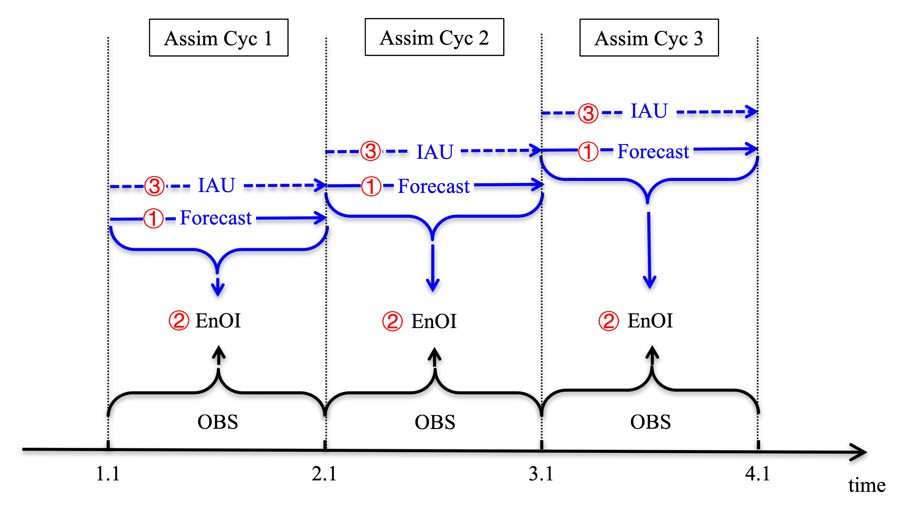

# Initialization scheme

## * EnOI-IAU scheme

Schematic diagram of the EnOI-IAU scheme. The EnOI-IAU scheme integrates two conventional assimilation approaches, ensemble optimal interpolation (EnOI) and incremental analysis update (IAU).This diagram illustrates three 1 month assimilation cycles. Each cycle includes three steps. The first step is ‘‘Forecast,’’ which generates a model forecast for the assimilation cycle. The second step is ‘‘EnOI,’’ which calculates an analysis increment through combining the forecast field and collected observational records in the window. The third step is ‘‘IAU,’’ which incorporates the analysis increment to the model as small constant forcing terms of the prognostic equations in each integration step. The final model state of the ‘‘IAU’’ step is used as an initial condition for the ‘‘Forecast’’ step in the next assimilation cycle. (Wu et al. 2018)

## Reference
* __Wu, Bo__, T. Zhou, F. Zheng, 2018: EnOI-IAU initialization scheme designed for decadal climate prediction system IAP-DecPreS. Journal of Advances in Modeling Earth Systems, 10(2), 342-356, DOI: https://doi.org/10.1002/2017MS001132