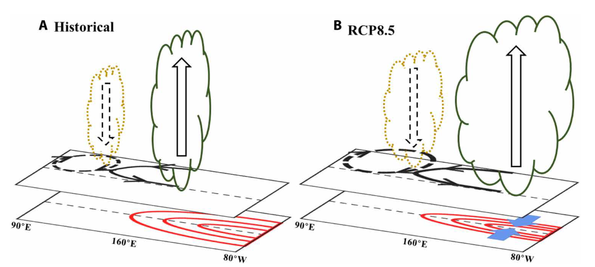

# ENSO

## * Change in ENSO-driven precipitation anomalies under global warming

Schematic diagram illustrating the physical processes responsible for the eastward shift and extension of ENSO-induced tropical precipitation anomalies under global warming. The weakened climatological tropical-subtropical cell (STC) associated with the weakened mean easterly trade wind leads to a meridional narrowing of ENSO-related warm SST anomalies by reducing poleward advection of anomalous warm water from the equator. This narrowing leads to stronger meridional temperature gradient anomalies, which enhance the ENSO-driven boundary-layer convergence anomalies over the equatorial central-eastern Pacific.This process plays a key role in the east-ward  shift  and  extension  of  ENSO-driven  positive  precipitation  anomalies over the central-eastern Pacific. In addition, the changes in the mean states,including moisture content, vertical motions, and vertical stratification  of  MSE,  and  positive  convection-cloud-longwave  radiation  feedback have contributions to the intensification of the ENSO-driven positive precipitation anomalies. The change in the positive precipitation anomalies over the central-eastern Pacific stimulates a cyclonic change in low-level wind anomalies to the west. The northerly component to  the  western  flank  of  the  cyclone  intensifies  ENSO-driven  negative precipitation anomalies over the tropical WNP by enhancing advection of low climatological moist enthalpy from the subtropics. (Yan, Wu et al. 2020)

## Reference
* Yan, Zixiang, __Bo Wu*__, T. Li, M. Collins, R. Clark, Zhou Tianjun, J. Murphy, Guirong Tan, 2020: Eastward shift and extension of ENSO-induced tropical precipitation anomalies under global warming, Science Advances, 6(2), eaax417, DOI: https://doi.org/10.1126/sciadv.aax4177
