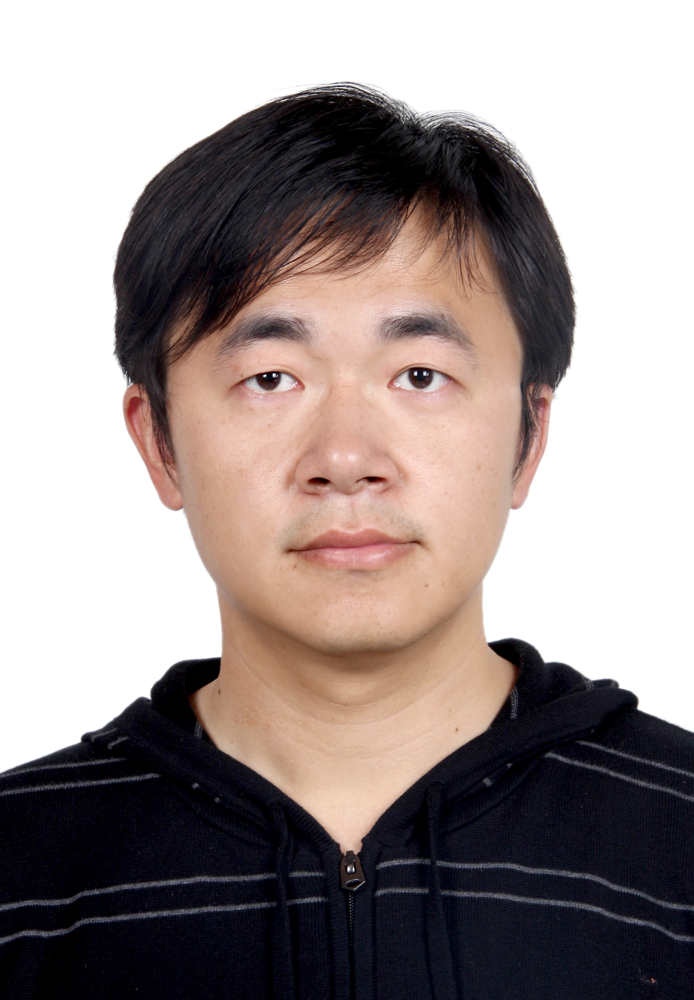

# Welcome to Bo WU's homepage

BO WU

Professor

State Key Laboratory of Numerical Modeling for Atmospheric Sciences and Geophysical Fluid Dynamics (LASG), Institute of Atmospheric Physics, Chinese Academy of Sciences.

[GoogleScholar](https://scholar.google.com/citations?user=M_sSZcUAAAAJ&hl=zh-CN)       [ResearcherID](https://publons.com/researcher/2857317/bo-wu/)

## Research Interests 

My research centers on "air-sea interactions" and "climate prediction". In the area of the "air-sea interactions", I focus on: 1) formation and maintenance mechanims of the western North Pacific anomalous anticyclone (WNPAC); 2) formation and growth mechanisms of Indian Ocean dipole (IOD); 3) mechanisms for ENSO-driven precipation anomalies and their changes under the global warming; 4) formation mechanisms of tropical Pacific decadal variability; 5) the global climate impacts of the Atlantic multi-decadal variability (AMV). In the area of the "climate prediction", I focus on the development of coupled assimilation scheme for model initialization and the development of prediction system based on coupled general circulation model. 

## Contact 
* Address: No. 40, Huayanli, Qijiahuozi, Chaoyang District, Beijing 100029, China P.R.
* E-mail: wubo@mail.iap.ac.cn

## Education
* Ph.D. (2009), LASG, Institute of Atmospheric Physics
* B.S. (2005), Meteorology, Nanjing University of Information Science and Technology, China

## Recent publications
Yan, Z., __B. Wu*__, T. Li, G. Tan, 2022: Mechanisms determining diversity of ENSO-driven equatorial precipitation anomalies, Journal of Climate, In press

 
