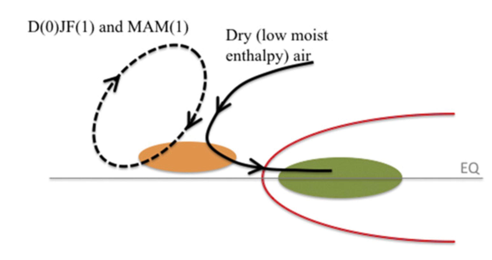
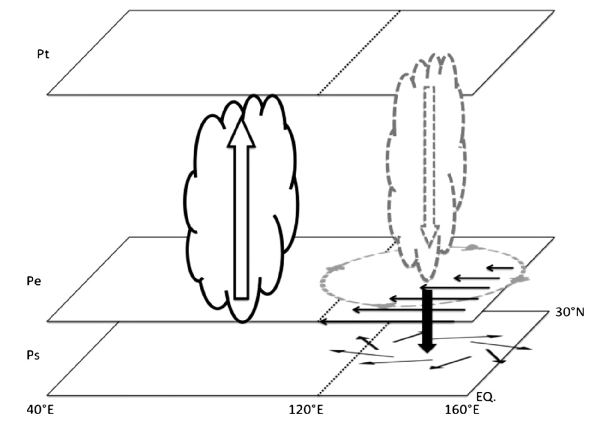
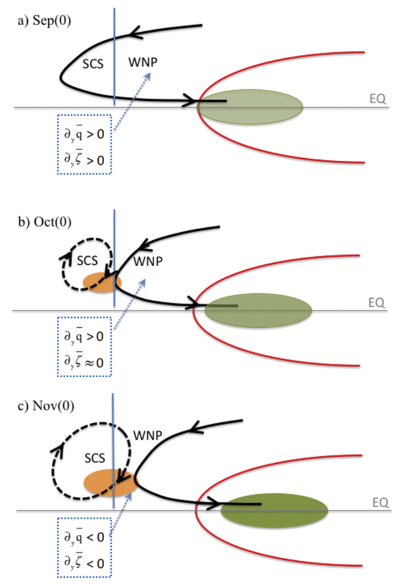

# Western North Pacific anomalous anticyclone (WNPAC)

## * "wind-induced moist enthalpy advection" mechanism

Schematic of the anomalous moist enthalpy advection mechanism, which is the most essential forcing mechanism responsible for the maintenance of the WNPAC during El Niño mature winter [D(0)JF(1)] and the following spring [MAM(1)]. Warm SSTAs in the equatorial central-eastern Pacific (red line) enhance local convection (green shading) and thus stimulate cyclonic anomalies to the northwest (black solid line). The northerly component of the western flank of the cyclonic anomalies advects off-equatorial dry (low moist enthalpy) air into the tropical western North Pacific and thus suppresses convection there (orange shading). The suppressed convection further stimulates the WNPAC (black dashed line) to the northwest. (Wu et al. 2017a)

## * "Kelvin-wave-induced boundary divergence" mechanism

Schematic diagram illustrating how the tropical IO heating influences the WNP monsoon during the El Niño decaying summer. Pressure at the surface, the top of the planetary boundary layer, and the top of the troposphere are denoted by Ps, Pe, and Pt, respectively. Inresponse to the enhanced convection over the tropical Indian Ocean, easterly wind anomalies (solid black arrowheads on Pe) are established as an atmospheric Kelvin wave response to the anomalous heating. The anomalous anticyclonic shear vorticity induces the anomalous subsidence (thick black arrowheads) resulting from the Ekman pumping effect and thus the boundary layerdivergence (solid black arrowheads between Pe and Ps). The anomalous boundary layer divergence further leads to suppressed convection (dashed curve and hollow arrowhead) and alow-level anomalous anticyclone (dashed circle) over the WNP. (Wu et al. 2009)

## * Season-dependent formation mechanism of WNPAC

Schematic of the formation of the WNPAC. a) During the early fall of El Niño developing phase [September(0)], the cyclonic anomalies stimulated by El Niño–related positive precipitation anomalies (green-filled ellipse) over the equatorial central-eastern Pacific extends westward to the South China Sea. The westward stretch of the cyclonic anomalies is enhanced by the positive meridional gradient of the mean relative vorticity ($\frac{\partial \overline{\zeta }}{\partial y}>0$). b) In mid-fall [October(0)], the cyclonic anomalies withdraw eastward due to the eastward shift of the positive precipitation anomalies over the equatorial central-eastern Pacific and the sharp weakening of the positive $\frac{\partial \overline{\zeta }}{\partial y}$ over the tropical western North Pacific. Meanwhile, the northerly component of the western flank of the cyclonic anomalies advects subtropical low moist enthalpy air into the SCS and causes negative precipitation anomalies there (orange-filled ellipse), which drives an anomalous anticyclone over the South China Sea. During this time, the meridional gradient of the mean specific humidity is still positive over the tropical western North Pacific ($\frac{\partial \overline{q}}{\partial y}>0$), so it is hard for negative precipitation anomalies to establish there. c) With the further eastward shift of the positive precipitation anomalies over the central-eastern Pacific and the formation of negative $\frac{\partial \overline{\zeta }}{\partial y}$ over the tropical western North Pacific, the cyclonic anomalies further withdraw and thus leave space for the establishment of the WNPAC. Meanwhile, the positive $\frac{\partial \overline{q}}{\partial y}$ changes to negative over the tropical WNP. These two factors cause the WNPAC to form in November(0) and completely establish in December(0). (Wu et al. 2017b)

## Reference 
* __Wu, Bo__, Tianjun Zhou, Tim Li, 2017a: Atmospheric dynamic and thermodynamic processes driving the western North Pacific anomalous anticyclone. Part I: Maintenance mechanisms. Journal of Climate, 30,9637-9650, DOI:https://doi.org/10.1175/JCLI-D-16-0489.1
* __Wu, Bo__, Tianjun Zhou, Tim Li, 2017b: Atmospheric dynamic and thermodynamic processes driving the western North Pacific anomalous anticyclone. Part II: Formation processes. Journal of Climate, 30, 9621-9635, DOI:https://doi.org/10.1175/JCLI-D-16-0495.1
* __Wu, Bo__, Tianjun Zhou, Tim Li, 2009: Seasonally Evolving Dominant Interannual Variability Modes of East Asian Climate, Journal of Climate, 22, 2992-3005, DOI:https://doi.org/10.1175/2008JCLI2710.

